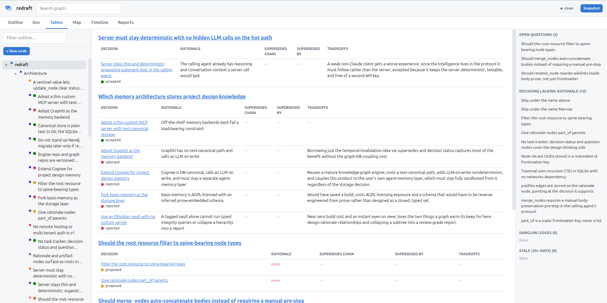
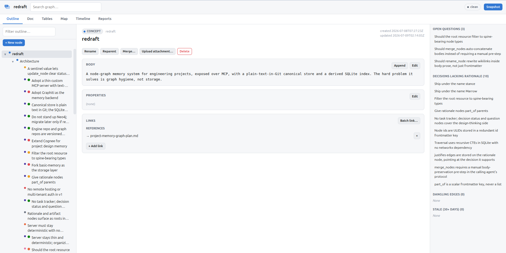
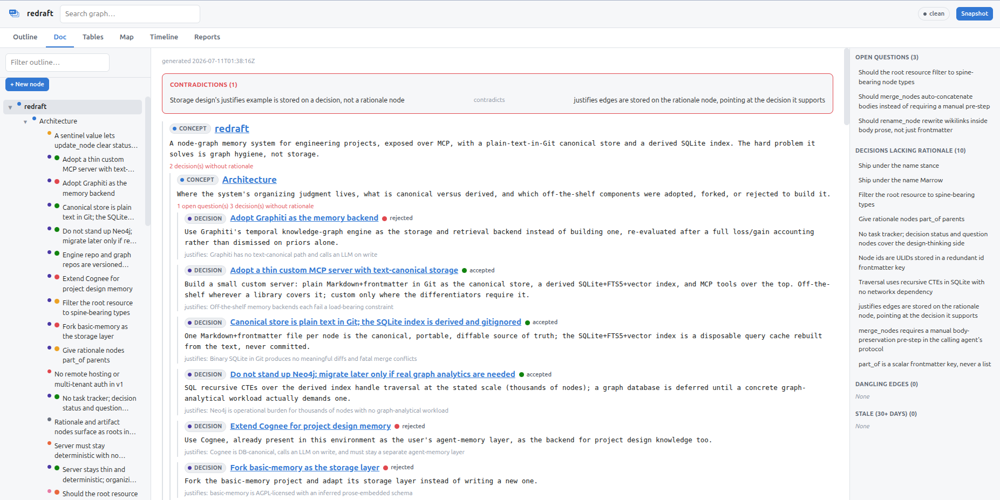
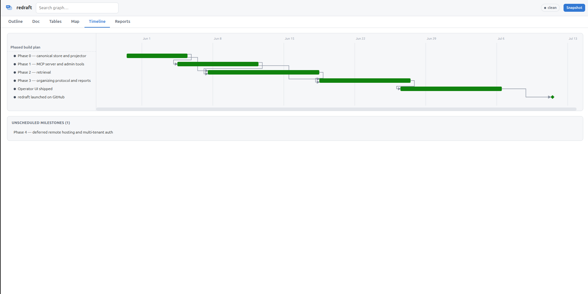
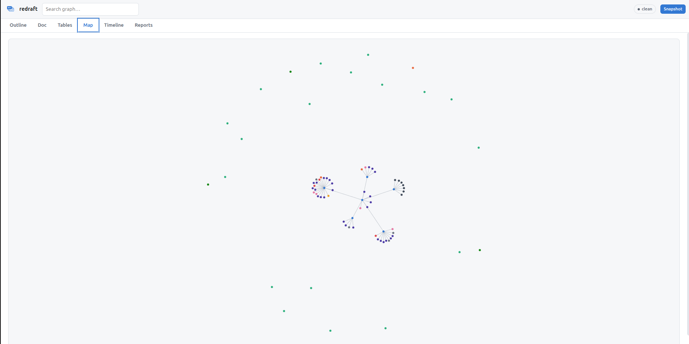
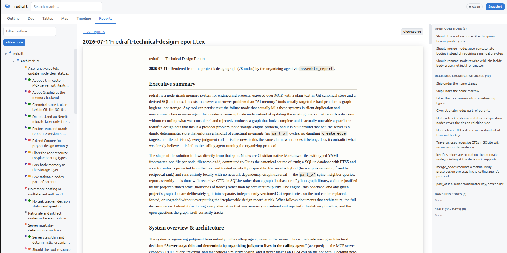

# redraft

AI-assisted project development and tracking: a typed, versioned design record for
engineering projects, exposed to Claude Code (or any MCP client) over MCP.



*The decision record, as the operator UI renders it: every decision grouped under the
question it addresses — accepted and rejected alternatives side by side, with rationale
and tradeoffs. The road not taken stays part of the record.*

## Why

Most project documentation is written as a design book: a linear narrative, drafted once,
read rarely, stale within a sprint. That is not how engineering projects actually produce
knowledge. Decisions, rationale, requirements, and open questions show up as sparse pieces
at wildly different levels of a project's hierarchy, at different times, and they only
become useful once linked back to what they addressed, what they ruled out, and what they
later superseded. redraft treats that as the real shape of the data instead of fighting it:
typed nodes and typed edges, stored as plain Markdown so git stays the source of truth. An
MCP server gives Claude Code the tools to organize the graph as the project evolves; reports
collapse it back into review-grade documents on demand -- including the roads not taken.

## Quickstart

**1. Clone and install the engine.**

```
git clone https://github.com/KaelinGraf/redraft.git redraft
cd redraft
uv tool install --from . redraft
```

This puts one command, `redraft`, on your `PATH` (run `uv tool update-shell` once if it
warns the bin directory isn't there yet). Working on the engine itself instead of just using
it? Skip the tool install and run `uv sync` -- `uv run redraft` then resolves to your local
checkout.

**2. Birth a graph.**

```
redraft init ~/my-project
```

Writes `graph/nodes/` (empty), a `CLAUDE.md` (the organizing protocol, verbatim), a
`.mcp.json` pointing at this graph (location-independent -- it keeps working if the graph
repo is later cloned to a different path or device), and, by default, its own independent
git history.
`redraft init --help` lists every option (`--no-git`, `--project-name`). Already have a
graph repo from another device? A plain `git clone` is all it takes -- see "Engine and graph
are separate repos" below.

**3. Start working.**

```
cd ~/my-project
claude
```

`.mcp.json` tells Claude Code how to launch `redraft serve` for this graph -- the tools
(`create_node`, `search_nodes`, `assemble_report`, and the rest) appear automatically once
the session starts.

`redraft serve` needs a uv-managed Python 3.12 (pinned in `.python-version`): the retrieval
stack requires a `sqlite3` build with FTS5 and extension-loading support, which a
`python-build-standalone` interpreter has and many system/distro Pythons don't -- it fails
fast with a clear error at startup if yours is missing either, rather than failing
confusingly inside a later tool call.

## Registering redraft in an existing project

The graph doesn't need to live inside a code project, and most of the time it shouldn't --
birth it as a sibling directory, then register it at Claude Code's project scope instead of
hand-writing a `.mcp.json`:

```
claude mcp add --scope project -e REDRAFT_DIR=<abs graph dir> -e PYTHONPATH= --transport stdio redraft -- redraft serve
```

`PYTHONPATH=` matters in any shell where something else (a ROS workspace is a common culprit)
has already polluted it -- an inherited entry can shadow redraft's own dependencies or
autoload an incompatible plugin.

## The operator UI

`redraft ui` serves a local web app over the same graph: an outline-first three-pane
view for reading and full authoring (create with live duplicate-detection hints, link,
batch-link, reparent, merge, upload, snapshot), plus a live document render, the
decision tables above, a dependency-aware milestone timeline, and a force-directed map.

| | |
|---|---|
|  *Outline — spine tree, node detail, attention strip* |  *Doc — the graph, rendered as a design document* |
|  *Timeline — milestones with real dependencies* |  *Map — the whole project, one connected graph* |

Ask your assistant for a technical report and it renders the graph into a review-grade
LaTeX document — decision tables, open questions, and all — saved under `reports/` and
displayed typeset in the Reports tab:



## Session-start overview

Every graph `redraft init` births ships with a Claude Code `SessionStart` hook
(`.claude/settings.json`) alongside `CLAUDE.md`/`.mcp.json`. It runs `redraft overview` --
the same cheap, embedding-free query the `overview` MCP tool and the `graph://project/overview`
resource expose -- and injects the resulting markdown map (spine roots, their major branches,
and per-branch tallies for open questions and unjustified decisions) straight into context at
the start of every new session, so the first real call is targeted instead of a blind guess.
It's on by default because that's the point of the feature; to turn it off, delete
`.claude/settings.json` (or just its one `SessionStart` entry, if you've since added other
hooks to that file) from the graph repo.

## Engine and graph are separate repos

This repo (the **engine**) is the MCP server, the storage/index code, and the CLI. It holds
no project data. A project's **graph** -- its node files, its `CLAUDE.md` (the organizing
protocol, written verbatim by `redraft init`), and its `.mcp.json` -- lives in its own repo,
with its own git history and its own remote, versioned entirely separately from the engine.

Why split them: the engine is replaceable tooling that gets upgraded, reinstalled, or
forked; the graph is the irreplaceable design record. Coupling their lifecycles would mean
every engine change risks the data, and every device would need the full engine source
checked out just to read a graph.

## Upgrading

Reinstalling a newer engine doesn't reach out and touch a graph you already have -- an
existing graph's `CLAUDE.md` (the organizing protocol) and `.claude/settings.json` (the
SessionStart hook) were written once, back when you ran `redraft init`, and stay exactly as
they were even after the engine that ships newer versions of both is installed. Run
`redraft sync` inside the graph to catch it up: it refreshes those two files (plus
`.gitignore`'s required lines) to whatever the newly installed engine ships, commits the
refresh if the graph is a git repo, and never touches `graph/nodes/`, `docs/`, or `reports/`
-- your project data is untouched either way. `CLAUDE.md` is engine-managed for exactly this
reason: don't hand-edit it, since the next sync overwrites it -- project-specific content
belongs in the graph's nodes, not the protocol file.

```
uv tool install --reinstall --no-cache --from . redraft
cd ~/my-project
redraft sync
```

Restart your Claude Code session afterward so it picks up the refreshed protocol and hook.

## What's inside

- **Node types**: `concept`, `decision`, `rationale`, `requirement`, `constraint`, `idea`,
  `question`, `artifact`, `observation`, `milestone` -- a closed set, each with its own
  narrow `status` lifecycle where one applies (only `decision`, `question`, and `milestone`
  carry a `status` at all).
- **Edge semantics**: `part_of` is the one scalar edge -- the hierarchy spine -- plus eight
  typed list edges: `justifies`, `supersedes`, `addresses`, `depends_on`, `contradicts`,
  `references`, `derived_from`, `relates_to`. `docs/protocol/organizing-protocol.md` is the
  full vocabulary and the rules an agent follows to use it well.
- **Hybrid retrieval**: FTS5 lexical search plus local sentence-embedding vector search
  (fastembed, no network calls), merged by reciprocal rank fusion.
- **Integrity checks**: dangling edges, title collisions, orphaned nodes, decisions with no
  recorded rationale -- checked against the derived SQLite index, which is fully rebuildable
  from the text files and never a second source of truth.
- **Reports with decision tables**: `assemble_report` walks a `part_of` subtree and groups
  every decision (any status) under the question or requirement it addresses, with
  rationale, tradeoffs, and supersession chains already resolved -- accepted and rejected
  alternatives rendered side by side, so the road not taken is part of the record instead of
  lost to it.
- **Versioning is local git commits**: every batch of graph writes ends in a `snapshot` —
  a pathspec-scoped commit in the graph repo's own git history. Local commits *are* the
  version history (diffable, revertable, blameable node-by-node); adding a remote and
  pushing is optional and entirely yours to decide.
- **Report generation, built in**: the organizing protocol every graph ships teaches the
  driving assistant to collapse the graph into technical writeups — `assemble_report`
  for the full spine with decision tables, `briefing(query)` for topical context — saved
  as LaTeX under `reports/` and rendered in the operator UI. The `redraft-report` skill
  packages the flow so "generate a technical report" is a one-liner.
- **Saved reference material**: `docs/` is a local, gitignored cache of referenced research —
  re-fetchable on any device from the `source_url` recorded on its `artifact` node via the
  `redraft-fetch-docs` skill — not versioned, so it doesn't travel with the graph and keeps the
  repo lean. `graph/attachments/`, which holds files uploaded onto a specific node through the
  operator UI, remains the committed option for files that must persist with the graph.

## Obsidian compatibility

The graph is plain Markdown with YAML frontmatter and `[[wikilink]]`-style edges under the
hood -- open a graph repo directly in Obsidian and it renders and navigates natively.
redraft is only required to organize the graph, never to read it.

## Claude Code skill

`skills/redraft-init/SKILL.md` walks Claude Code through birthing a graph for a project and
registering it, so you can just ask instead of following the Quickstart by hand. Symlink or
copy it into `~/.claude/skills/`:

```
ln -s "$(pwd)/skills/redraft-init" ~/.claude/skills/redraft-init
```

`skills/redraft-fetch-docs/SKILL.md` re-fetches a graph's local `docs/` cache (see above) from
each artifact node's recorded `source_url`; symlink it the same way (`ln -s "$(pwd)/skills/redraft-fetch-docs" ~/.claude/skills/redraft-fetch-docs`).

`skills/redraft-report/SKILL.md` packages the report flow: assemble the graph, write a
grounded LaTeX technical report into `reports/`, snapshot it — so "generate a technical
report" is a one-liner in any session with a redraft graph connected
(`ln -s "$(pwd)/skills/redraft-report" ~/.claude/skills/redraft-report`).

## Running tests

```
env -u PYTHONPATH uv run pytest -q
```

## License

Apache-2.0. See `LICENSE`.
